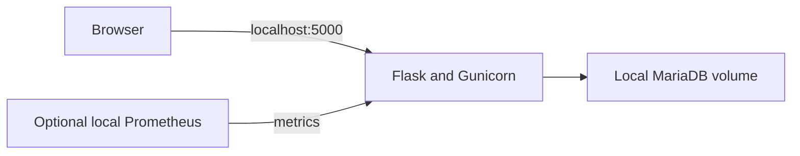
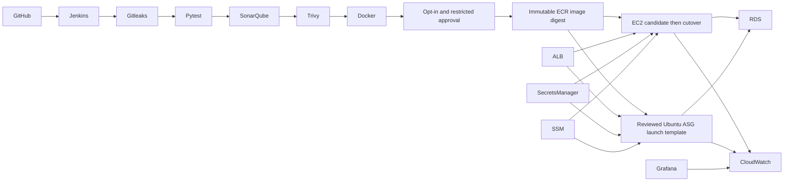

# ApexForge360 CloudOps Portal

An open-source, hands-on AWS DevSecOps and CloudOps reference project demonstrating secure CI/CD, immutable container delivery, controlled deployments, infrastructure automation, observability and real-world troubleshooting.

**Learning/reference project:** review security and environment-specific settings before production use. The original canary cutover was validated. Ubuntu ASG first boot experienced failures; final live ASG acceptance is pending. No availability, performance or certification claims are made.

## Two ways to learn

- **Local:** Flask/Gunicorn, MariaDB and Docker Compose; no AWS account or credentials.
- **Independent AWS laboratory:** configure your own reviewed inventory, IAM roles and Jenkins environment. Public CI builds/tests/scans only by default.

## Five-minute local start

Ubuntu, WSL2 with Docker Desktop integration, or Docker Desktop on Linux containers:

Prerequisites: Docker Engine/Desktop with Compose v2 or later, Linux AMD64 containers and internet access for reviewed image/package downloads. Native tests use Python 3.12. The production dependency lock intentionally fails on unsupported platforms.

```bash
git clone https://github.com/muhammadbilal-7861/ApexForge-CloudOps-Portal.git
cd ApexForge-CloudOps-Portal
cp .env.example .env
docker compose up -d --build --wait
docker compose exec app flask --app wsgi init-db
docker compose exec app flask --app wsgi seed-demo
curl --fail http://127.0.0.1:5000/health
curl --fail http://127.0.0.1:5000/ready
```

Image downloads can take longer than five minutes. Open http://localhost:5000. Register an account or use **local-demo / development-only-demo-password** (public, development-only). Sample data is synthetic. Compose publishes only on localhost and does not mount AWS credentials. On PowerShell use `Copy-Item .env.example .env`; run the other commands unchanged. MariaDB storage persists in a project-scoped named volume.



## AWS laboratory architecture



The architecture is implemented through scripts and existing resources; this repository does not provision a complete AWS account/VPC/RDS/Jenkins stack. See [architecture](docs/ARCHITECTURE.md), [configuration](docs/CONFIGURATION.md) and [controlled deployment](docs/DEPLOYMENT.md).

## Stack and completed capabilities

| Component | Responsibility |
| --- | --- |
| Python 3.12, Flask, SQLAlchemy, Flask-Login/CSRF | Registration, login, records, guarded S3 uploads, health/readiness/metrics |
| Gunicorn and pinned Docker build | Non-root runtime; locked Python dependencies and reproducible image contract |
| Jenkins, Gitleaks, SonarQube, Trivy | Tests, secrets/SAST/SCA/image checks, evidence and restricted approval |
| AWS CLI, ECR, SSM | Instance-role authentication, immutable tag reuse and digest-pinned delivery |
| Ubuntu 24.04, EC2/ASG, ALB | Candidate-first cutover, clean first-boot gate and verified rollback |
| CloudWatch, Prometheus, Grafana, Alloy | Controlled bootstrap diagnostics and optional monitoring exercises |

Completed: local application; canary logic and validated original cutover; simulated rollback, networking, permission and ASG regressions; security pipeline foundation. Still under development: live acceptance of reusable configuration and Ubuntu ASG bootstrap, infrastructure provisioning, hardened production edge and operational SLOs.

## Pipeline and safety boundaries

Checkout → build information → Gitleaks → locked dependencies → pytest → SonarQube → webhook Quality Gate → Trivy filesystem/SCA/config → IaC extension → Docker build → Trivy image → report manifest.

AWS stages run only with **AWS_OPERATIONS=true**, reviewed private configuration, exact `main` HEAD, expected account/role, blocking HIGH/CRITICAL gates and designated human approval. `DEPLOY_TARGET=none` is the default; this also means an explicitly approved publication-only run can publish without deploying. A second approval binds a deployment to the reviewed digest/candidate preview.

Secrets, failing tests and Sonar Quality Gate failures block. Trivy complete reports retain fixed and unfixed HIGH/CRITICAL vulnerabilities; vulnerability enforcement blocks vendor-fixable findings. Unfixed vulnerabilities need documented risk review. IaC misconfiguration gates do not use `--ignore-unfixed`. Report-only Trivy mode cannot publish or deploy.

## Tests and supply-chain updates

```bash
python3 -m venv .venv
. .venv/bin/activate
pip install --only-binary=:all: --require-hashes -r requirements.txt
pytest -q
python -m compileall -q app deploy tests wsgi.py
```

Root-only simulated bootstrap tests are skipped on an unprivileged host; use an isolated disposable Linux test container for complete coverage. Do not run integration rehearsals against production Docker/AWS. [Reproducible build procedure](deploy/REPRODUCIBLE-BUILDS.md) covers reviewed base-image, Debian security package and Python lock updates. Update pins deliberately, rebuild twice, scan and review; never overwrite an immutable ECR commit tag.

## Observability and troubleshooting

`/health` is liveness; `/ready` verifies DB connectivity; `/metrics` is intentionally unauthenticated for private scrapers. Restrict metrics at the ALB/security-group boundary. `observability/` contains synthetic AWS examples, not a turnkey production monitoring stack. For a local scrape use [local Prometheus example](observability/prometheus/local.example.yml).

Useful lessons: retain scanner metadata in Jenkins' named volume; put root-owned Trivy cache in its own Docker volume; normalize canonical Docker IDs; compare effective IPv4/IPv6 publications; do not inherit launch-template Placement; dry-run both private subnets; distinguish denied ALB API access from unhealthy targets. Bootstrap diagnostics expose controlled stage/status/line information, never secret values. See [historical investigation](deploy/ASG-BOOTSTRAP-INVESTIGATION.md).

## Costs and cleanup

Local: `docker compose down` stops this project; it retains database data. Only after choosing to discard **your local** demo database use `docker compose down --volumes`. Never use global Docker prune.

AWS: EC2/Jenkins/observability, ALB, NAT or interface endpoints, RDS, CloudWatch ingestion/retention and ECR storage incur separate charges. Consult current AWS pricing for your region; there is no verified monthly estimate here. Set a budget and tag resources. After owner approval, scale only the reviewed laboratory ASG down, inspect target deregistration, then retire explicitly inventoried resources. Preserve rollback evidence and backups. The canary is never automatically retired.

Create a region-specific estimate in [AWS Pricing Calculator](https://docs.aws.amazon.com/pricing-calculator/latest/userguide/getting-started.html): instance count × running hours × hourly rate, plus database compute/storage/backups, load-balancer hours/usage, networking, image storage and log ingestion/retention. Compare an always-on lab with a scheduled lab; stopping EC2 does not remove storage/network/database charges. [Estimate inputs](https://docs.aws.amazon.com/pricing-calculator/latest/userguide/generate-estimate.html) must reflect your chosen infrastructure rather than the original deployment.

## Security, contribution and portfolio

Read [SECURITY.md](SECURITY.md), [redacted audit](docs/SECURITY-AUDIT.md) and [CONTRIBUTING.md](CONTRIBUTING.md). Portfolio screenshots belong in `docs/assets/` only after sanitization: local synthetic dashboard, scanner summary, simulated rollback and architecture. Do not capture account dashboards, secrets, private endpoints or raw deployment output.

**License pending owner decision.** MIT or Apache-2.0 are possible choices; no license terms have been selected. Public visibility alone does not grant an open-source license. Contributor attribution and Git history are retained.
