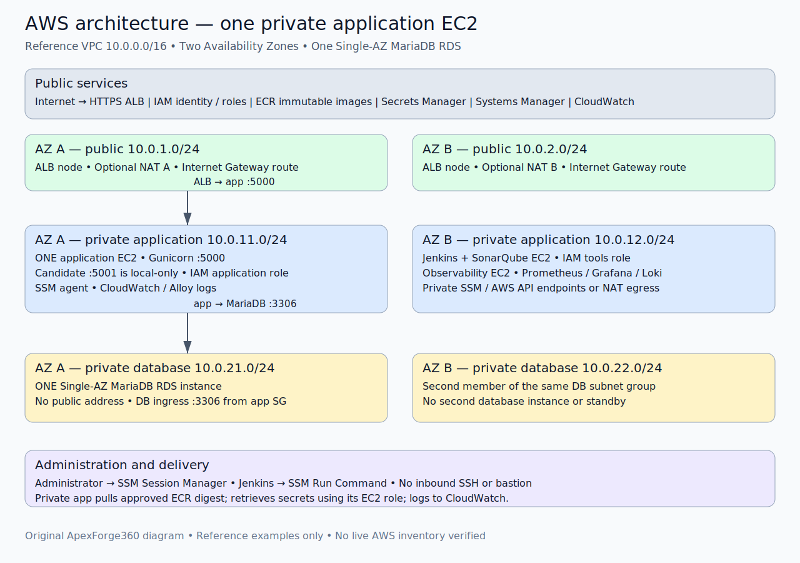
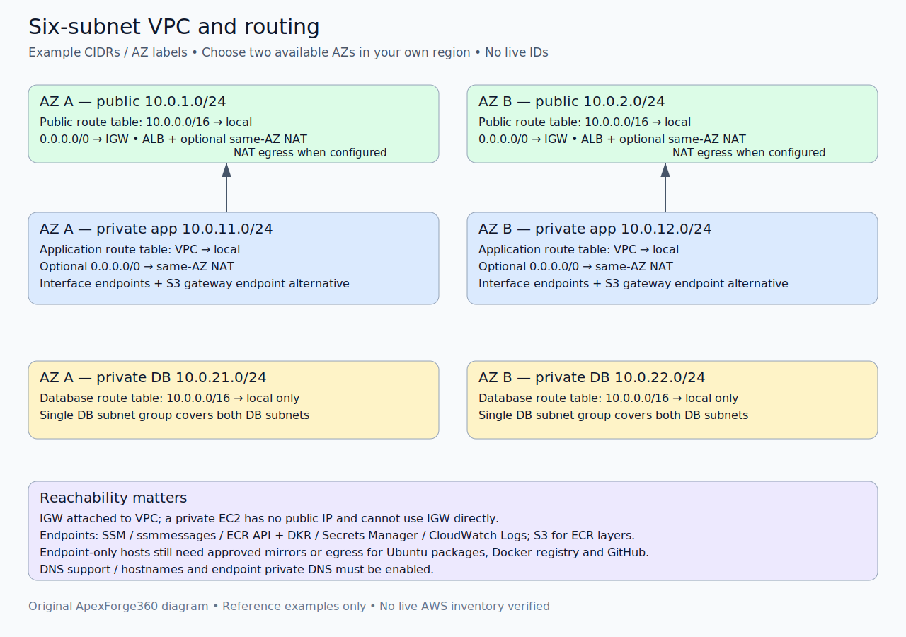
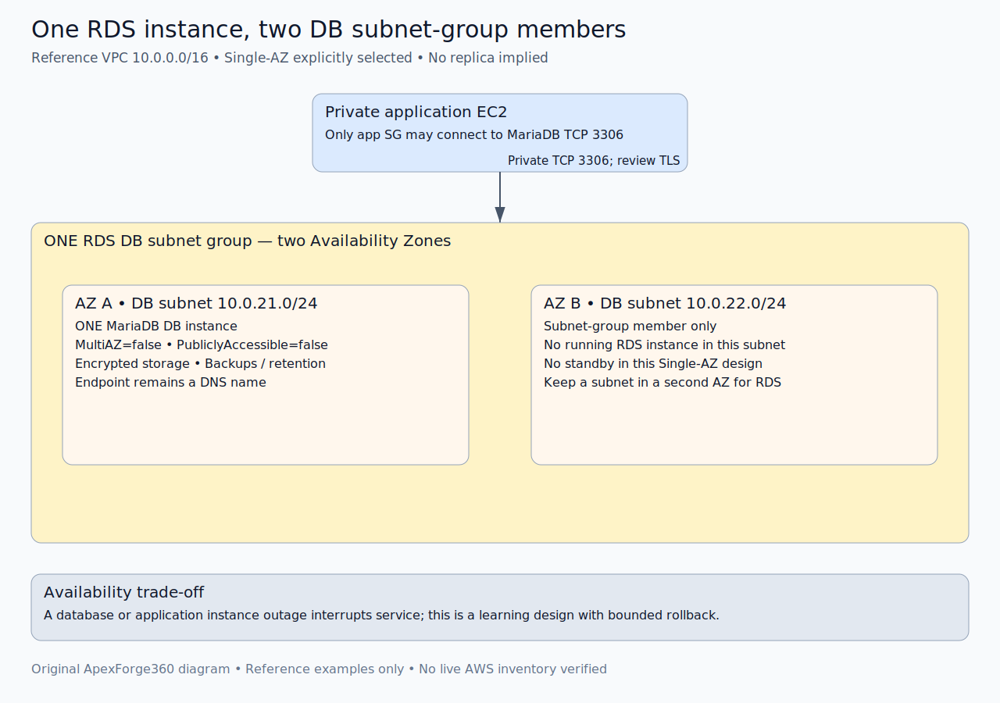
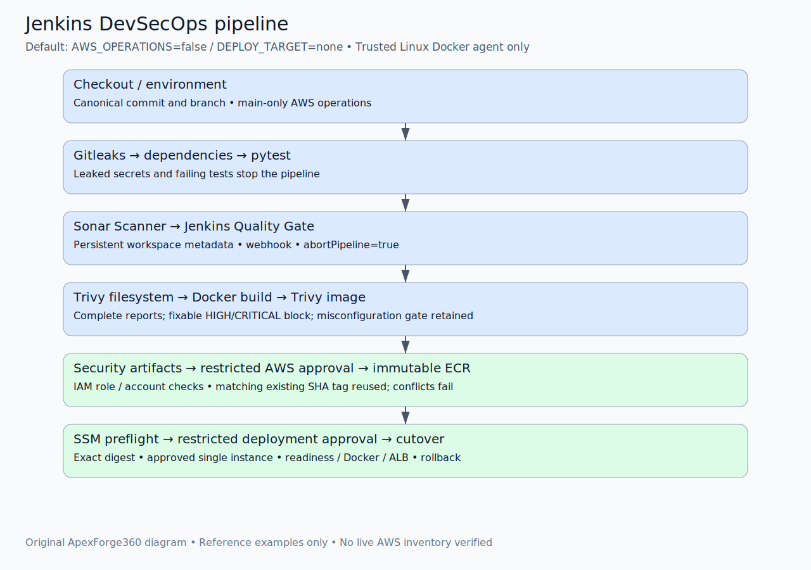
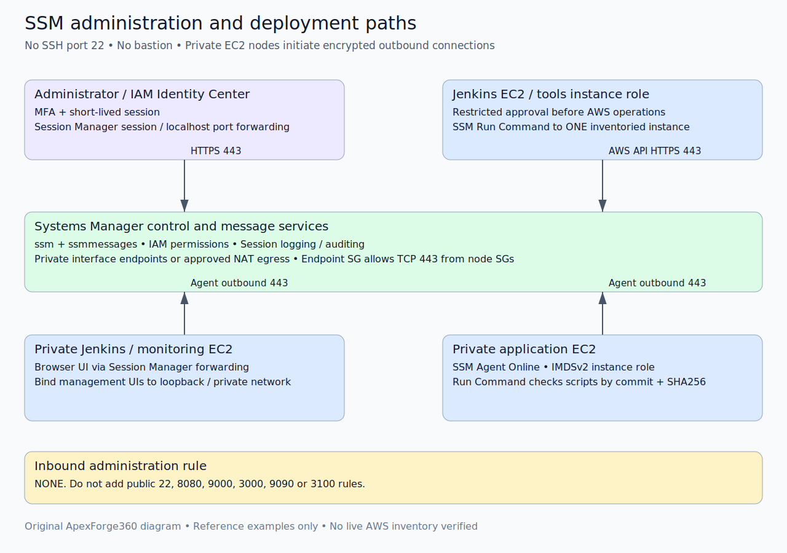
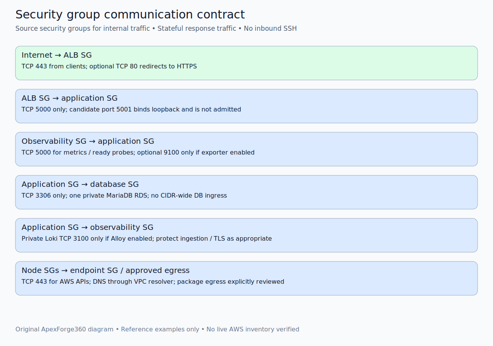
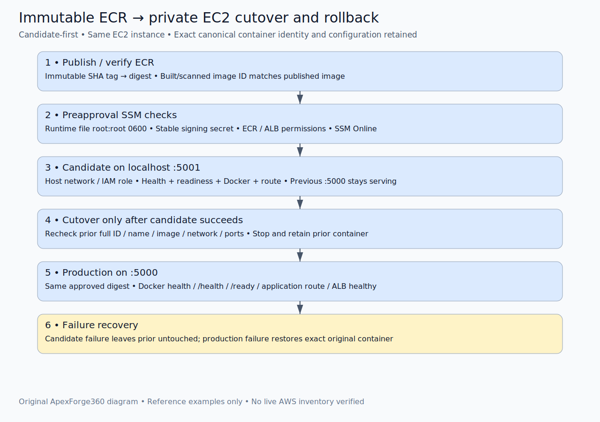
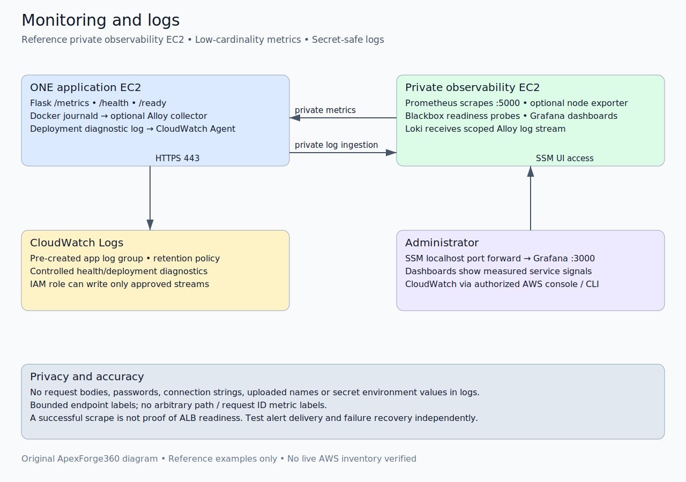

# ApexForge360 learner master guide

Build an independent, **single-application-EC2** DevSecOps lab from a fresh clone. All AWS commands are instructions for your reviewed account; they were not executed during repository preparation. Use short-lived SSO credentials on your workstation, never in Jenkins. No original private ID is required.

## Learning order and dependencies

| Lab | Topic | Result |
| --- | --- | --- |
| [01](labs/01-account-local.md) | Account, local Docker Compose | Working app, safe identity/budget |
| [02](labs/02-vpc-routing.md) | VPC/six subnets/routes | Two AZs; public/app/DB boundaries |
| [03](labs/03-security-groups.md) | SGs/endpoints | Exact internal flows; no SSH |
| [04](labs/04-rds-secrets.md) | One MariaDB RDS/secrets | Single-AZ DB and stable secret |
| [05](labs/05-iam-ssm.md) | Roles/Session Manager | Private administration |
| [06](labs/06-private-ec2.md) | Clean Ubuntu/Docker/CLI | Owned app/tools/monitoring hosts |
| [07](labs/07-ecr-alb.md) | ECR/HTTPS ALB | Immutable registry and edge |
| [08](labs/08-cloudwatch.md) | CloudWatch | Controlled deployment diagnostics |
| [09](labs/09-inventory-policies.md) | Inventory/IAM | Account-specific, fail-closed contract |
| [10](labs/10-jenkins-sonar-security.md) | Jenkins/Sonar/Gitleaks/Trivy | Gates and designated approvals |
| [11](labs/11-monitoring.md) | Prometheus/Grafana/Loki/Alloy | Metrics, readiness and scoped logs |
| [12](labs/12-testing-builds.md) | Tests/reproducibility/audit | Evidence before release |
| [13](labs/13-deployment-rollback.md) | First install/cutover/rollback | One digest-pinned application |
| [14](labs/14-cleanup.md) | Cost/retirement | Owned-resource cleanup review |

Follow the dependencies explicitly: Lab04 creates RDS but its private SQL administration waits for Lab06's SSM host. Lab06 launches clean hosts, but its runtime-file step waits for Lab09's inventory/policies. Lab07 creates the unhealthy initial target; Lab10 can publish with DEPLOY_TARGET=none. Lab13 uses that gated digest for initial schema setup before the first approved deployment. Monitoring log collection waits for a successful app release.

## Command conventions

Bash/WSL workstation variables persist only in the current shell. Maintain a private resource ledger and re-export verified values after reopening it. SSM shell commands execute **on the named private host**, not the workstation. Marked example addresses are never observed live values. Replace YOUR-GITHUB-OWNER/YOUR-FORK and every reviewed image reference before use. Do not paste secret placeholders as actual passwords.

## Reference architecture and visual atlas

One VPC10.0.0.0/16; six subnets across AZ A/B; two public ALB/NAT subnets; two private application subnets; two private DB subnets in one DB subnet group; **one Single-AZ RDS MariaDB**, no second DB implied. One app EC2, separate Jenkins/Sonar and observability EC2s. SSM-only administration, SSM Run Command delivery, IAM roles, ECR, Secrets Manager and CloudWatch. IGW/NAT/endpoints are explicit; package downloads still need egress or mirrors.

Each original drawing has a GitHub-compatible PNG and editable text/group-based SVG:

### Complete AWS architecture

[Editable SVG](diagrams/01-architecture.svg)

### Six-subnet VPC and routing

[Editable SVG](diagrams/02-vpc-routing.svg)

### One RDS and its two-subnet group

[Editable SVG](diagrams/03-rds.svg)

### Jenkins DevSecOps pipeline

[Editable SVG](diagrams/04-pipeline.svg)

### SSM administration and Run Command

[Editable SVG](diagrams/05-ssm.svg)

### Security group communication

[Editable SVG](diagrams/06-security-groups.svg)

### ECR delivery and exact rollback

[Editable SVG](diagrams/07-deployment-rollback.svg)

### Monitoring and logs

[Editable SVG](diagrams/08-monitoring.svg)

## Edit and validate the diagrams

Edit `docs/generate_diagrams.py` or individual SVG text/groups; preserve example labels. In a separate documentation venv install CairoSVG, then run `python docs/generate_diagrams.py` from repository root. PNGs are derived artifacts, not console screenshots. Run `python docs/validate_docs.py` to check links, PNG headers/dimensions, SVG XML and lab structure. [Actual validation](VALIDATION.md) distinguishes local proof from untested AWS operations.
