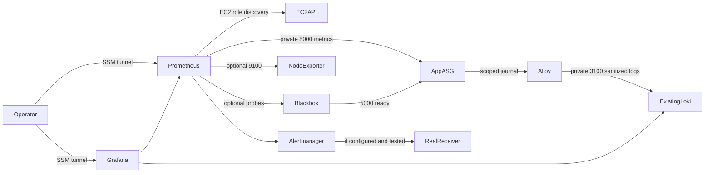

# Existing CloudOps observability server

## FIRST: discovery and reconciliation

Reuse EC2 **i-0c550edbaa5ecbdff** (previously stopped, t3.small). Its last observed private IP **10.0.11.62** is UNVERIFIED. Installed images, Compose paths and volumes remain unknown until inventory. Do not create a parallel stack or delete monitoring data. No tools host or separate RDS project changes are required.

From an authorized operator workstation with AWS CLI and Session Manager plugin:

```bash
aws ec2 describe-instances --region eu-north-1 --instance-ids i-0c550edbaa5ecbdff --query 'Reservations[].Instances[].{State:State.Name,IP:PrivateIpAddress,VPC:VpcId,Role:IamInstanceProfile.Arn,Metadata:MetadataOptions}'
aws ec2 start-instances --region eu-north-1 --instance-ids i-0c550edbaa5ecbdff
aws ec2 wait instance-running --region eu-north-1 --instance-ids i-0c550edbaa5ecbdff
aws ssm describe-instance-information --region eu-north-1 --filters Key=InstanceIds,Values=i-0c550edbaa5ecbdff
aws ssm start-session --region eu-north-1 --target i-0c550edbaa5ecbdff
# In SSM shell, from a private checkout:
sudo bash observability/scripts/inventory.sh
```

Inventory lists Docker containers, Compose projects/config paths, image IDs, mounts/volumes, ports and health without environment dumps. Inspect configs under `/opt` privately, including Grafana provisioning and Loki schema/storage. Inventory systemd services too if Docker does not own a service. Keep output private and redact before sharing: mount options/paths can contain sensitive values. Back up actual data before changes. Follow [the reconciliation plan](RECONCILIATION.md) and review inventory before merge. No installed version is assumed; no script overwrites existing Compose.

## SSM-only access

Run each tunnel in a separate workstation terminal:

```bash
aws ssm start-session --region eu-north-1 --target i-0c550edbaa5ecbdff --document-name AWS-StartPortForwardingSession --parameters '{"portNumber":["3000"],"localPortNumber":["3000"]}'
aws ssm start-session --region eu-north-1 --target i-0c550edbaa5ecbdff --document-name AWS-StartPortForwardingSession --parameters '{"portNumber":["9090"],"localPortNumber":["9090"]}'
```

Open `http://localhost:3000` (existing Grafana login) and `http://localhost:9090`. Use local 13000/19090 if occupied. PowerShell can use CLI shorthand `--parameters 'portNumber=3000,localPortNumber=3000'` (9090 analogously). Bind UIs to host loopback; no SG ingress on 3000/9090/9093/9115. Loki has private ingress only. SSM requires existing host agent/role, operator authorization and private endpoints or approved HTTPS egress. See [AWS session examples](https://docs.aws.amazon.com/systems-manager/latest/userguide/session-manager-working-with-sessions-start.html).

## EC2 discovery and IMDSv2

`prometheus/prometheus.example.yml` is a MERGE example. It discovers running instances in eu-north-1/VPC vpc-080d46671dbdcacab with BOTH tags Role=app and Monitoring=enabled. This includes i-02777a62f2a65bc1e and future asg-cloudops-app nodes once tagged. Private addresses scrape `/metrics`:5000. Optional node_exporter discovery additionally requires NodeExporter=enabled; apply that tag only after installing a reviewed pinned exporter on private port 9100. Python process metrics are not host metrics.

`iam/prometheus-role-policy.json` grants only ec2:DescribeInstances (Resource `*` is required). Attach to monitoring instance profile, retaining separately required SSM permissions. Use temporary role credentials, never static keys. Check metadata options with the operator DescribeInstances command. Require IMDSv2. Test from host and Prometheus execution network without printing credentials:

```bash
token=$(curl --fail --silent --max-time 3 -X PUT -H 'X-aws-ec2-metadata-token-ttl-seconds: 60' http://169.254.169.254/latest/api/token)
curl --fail --silent --max-time 3 -H "X-aws-ec2-metadata-token: $token" http://169.254.169.254/latest/meta-data/iam/security-credentials/
unset token
```

The last request shows role NAME only; do not append the name and dump credentials. Use available tooling in the existing execution network. Host networking avoids bridge response-hop issues. A bridged container may require hop limit 2: assess container trust and least privilege before a reviewed metadata change, never disable token requirements. Record current options and verify SDK discovery, DNS/HTTPS EC2 API access. See [Prometheus configuration](https://prometheus.io/docs/prometheus/latest/configuration/).

Check `/targets`, `/service-discovery`, `up{job="cloudops-app"}` and `curl -fsS http://127.0.0.1:9090/api/v1/targets`. `up` means scrape success, not database readiness. Terminated ASG nodes disappear from discovery; individual down alerts may disappear before firing. An absent-pool alert covers an entirely empty pool, not desired capacity.

## Readiness, dashboard and worker limitation

`/health` is liveness; `/ready` executes SELECT 1 and returns 503 on failure. Enable the optional cloudops-ready job ONLY after a reviewed pinned blackbox exporter uses `prometheus/blackbox.example.yml` on loopback 9115. It probes private `/ready`:5000, accepting only 200. Exporter failures have a separate up alert. Readiness failure alone cannot prove an RDS outage.

Import `grafana/cloudops-dashboard.json` selecting existing data sources. Provisioning files are opt-in after UID/org/network inventory. Preserve existing dashboards and sources. Queries use actual metric names from `app/monitoring/metrics.py`: HTTP requests/errors have status; histograms have method/endpoint. Endpoint is Flask endpoint name, not URL. Host/readiness panels require optional exporters and otherwise show no data. Instance count means scrapeable discovered app nodes, not ASG desired count or ALB target health. No CloudWatch metrics are invented. Future target-health collection requires justified ELB DescribeTargetHealth permissions scoped as supported to tg-cloudops-app; desired count requires autoscaling:DescribeAutoScalingGroups. CloudWatch exporters need justified GetMetricData/ListMetrics for selected real metrics. None are included here.

**Two-worker limitation:** Dockerfile uses Gunicorn workers=2 but metrics.py uses process-local REGISTRY without multiprocess collection. Scrapes can alternate workers; rates/quantiles/minimum-traffic alerts are provisional. No application code is modified. A separate fix must set PROMETHEUS_MULTIPROC_DIR before import, initialize/clear it once per container startup (never per worker), use a separate scrape CollectorRegistry with MultiProcessCollector and Gunicorn child_exit dead-worker cleanup. Test actual two-worker traffic, aggregate counters/histogram buckets, worker replacement and container restart before adoption. Default process collectors are not aggregate host metrics. A reviewed temporary single-worker rollout has a capacity tradeoff. Neither approach is claimed tested/deployed here.

## Alloy: scoped, sanitized container stdout

Current app logs are text request summaries with user IDs and exception traces, not exclusively JSON. `alloy/config.alloy` selects CONTAINER_TAG=cloudops and reconstructs only known-route request summaries. It retains canonical UUID request IDs in the log BODY, not high-cardinality labels, plus fixed route/method/status/duration. Custom non-UUID IDs, arbitrary paths, user IDs, cookies, Authorization, exception/SQL traces and Gunicorn access logs are dropped. This conservative stream is not a complete audit/error feed; DB/login counters provide indicators. Review privacy fixtures before expanding the allowlist.

Use `alloy/app-logging.example.yml` during the deployment owner's reviewed app rollout, or `docker run --log-driver=journald --log-opt tag=cloudops ...`. Do not change global Docker logging. Give only CloudOps that tag and inspect `journalctl CONTAINER_TAG=cloudops` privately. Configure persistent journald storage with bounded retention. No Docker socket is mounted. Even a read-only socket mount grants security-sensitive Docker API access; it is not a permission sandbox. bootstrap uses privileged local inspect of one exact container; Alloy has no Docker group membership. Journal group membership can read other host logs despite source filtering, so protect the account/config. For stronger isolation, use a reviewed app-only restricted log-file export and read-only file source.

Install a reviewed pinned Alloy Linux binary at `/usr/local/bin/alloy`, verify upstream checksum/signature and record version/digest. Linux systemd, journald/systemd-journal group, curl and Docker are required. Confirm monitoring IP on every app boot/rollout via operator DescribeInstances; pass it through launch configuration or maintained private DNS. No extra app-role discovery permission is needed with operator-fed configuration. The ASG deployment hook must receive that confirmed endpoint and run bootstrap after starting the exact CloudOps container:

```bash
aws ec2 describe-instances --region eu-north-1 --instance-ids i-0c550edbaa5ecbdff --query 'Reservations[0].Instances[0].PrivateIpAddress' --output text
# App SSM shell: use confirmed IP, actual container and environment:
sudo env CLOUDOPS_CONTAINER=cloudops-app CLOUDOPS_ENVIRONMENT=production LOKI_PRIVATE_IP=10.0.11.62 bash observability/alloy/bootstrap.sh
systemctl status cloudops-alloy
```

The example IP is valid ONLY after confirmation. bootstrap checks Loki `/ready`, gets instance ID with IMDSv2, derives image version from container image reference, validates Alloy, and starts systemd. Use immutable ECR commit tags/digests for code provenance. Rerun bootstrap on image changes to update labels. Positions persist in `/var/lib/cloudops-alloy`; never delete on restart. Keep journal tag stable across container replacement. Rotation before collection loses logs; size retention for outages and test recovery. max_age=1h bounds replay, so longer outages can lose older entries; write retry buffers do not guarantee durable delivery. Linux journal runtime checks remain required. See [journal source](https://grafana.com/docs/alloy/latest/reference/components/loki/loki.source.journal/) and [processing stages](https://grafana.com/docs/alloy/latest/reference/components/loki/loki.process/).

## Alerting

Rules include app down for 2m, no discovered apps, >5% 5xx for 5m with >=100 requests/5m, p95 >1s for 5m, optional CPU >90% for 10m, readiness outage for 2m and readiness-exporter failure. Tune after baseline. HTTP error counter includes 4xx; the 5xx ratio uses status-filtered requests. Counter-based alerts inherit the worker limitation.

Alertmanager example has a receiver with NO integration and sends NOTHING. Merge into existing routing or replace the disabled receiver with an approved real integration, credentials outside Git. Validate with amtool and a synthetic notification before claiming delivery. No fake webhook/email is supplied.

Missing ingestion is measurable only when logs are expected. Compare `sum(count_over_time({service="cloudops"}[10m]))` with continuous safe synthetic UUID requests. Quiet apps can legitimately produce no logs. An optional Loki ruler alert `absent_over_time({service="cloudops"}[10m])` is appropriate only once such a generator and actual ruler/Alertmanager routing are inventoried/validated. It misses individual-node gaps unless expected instance labels are maintained; do not treat it as fleet coverage. Scrape observed Alloy read/write/failure counters on loopback 12345 if configured; no invented remote-ingest-success metric is shipped.

## Network and IAM

- Monitoring SG -> app SG TCP 5000; optionally 9100 for installed node_exporter.
- App SG -> monitoring SG TCP 3100; monitoring inbound 3100 only from app SG. Confirm IP/routing/NACLs. No Internet 0.0.0.0/0 ingress.
- Grafana/Prometheus/Alertmanager/blackbox bind loopback, accessed over SSM. Loki binds a reachable private interface or private publication protected by SG.
- ALB needs higher-priority deny/fixed-403 rules for `/metrics` AND `/metrics/*` before general forwarding. Verify encoded/trailing variants from public URL and reinforce proxy rules if necessary. App route is public; this is a REQUIRED deployment gate, not protection supplied by these files. App SG 5000 admits only ALB SG and monitoring SG. tg-cloudops-app keeps health path `/ready`.
- Preserve existing SSM/ECR/app roles. Monitoring needs no DB secrets, RDS changes, tools-host access or static AWS keys.

## Validation and maintenance test plan

Run `bash observability/scripts/validate.sh` with reviewed matching-version promtool, amtool, Alloy and Python/PyYAML. It checks config/rules, rule timing, assets, privacy fixtures and shell syntax. Local `--syntax-only` skips deployment absolute file references; full validation with real mounted files is mandatory. Loki config is not invented: validate the actual inventoried config without applying it:

```bash
docker exec <existing-loki-container> /usr/bin/loki -verify-config=true -config.file=<actual-mounted-config>
promtool check config <candidate-prometheus.yml>
promtool check rules observability/prometheus/cloudops-rules.yml
(cd observability/prometheus && promtool test rules rules.test.yml)
```

1. Start/inventory existing host over SSM. Review backup/restore, pins, SGs and public ALB metrics denial. Never `docker compose down -v`.
2. Validate existing Loki, merged Prometheus/rules/Alertmanager, Alloy and effective Compose; review diffs before targeted reload/restarts.
3. Internally curl app `/metrics`, `/health`, `/ready`, monitoring private Loki `/ready` and optional node 9100. Check all tagged ASG targets and Grafana health.
4. Generate GET /health and /ready with fresh UUID X-Request-ID and no user data. Verify Loki service/ec2_instance_id/environment/image_version labels, request_id body and dashboard queries subject to worker limits.
5. In disposable test environment restart collector, rotate journal, test endpoint outage/recovery and new ASG image labels. Confirm unrelated logs/private values never ship and positions recover.
6. In an approved maintenance window stop a disposable app CONTAINER for >2m while its instance remains discovered; verify firing/resolved up alert. Separately stop a disposable EC2 if requested: discovery may remove it before 2m. Test absent-pool only in isolated fleet or a separately implemented desired-capacity alert; do not stop all production nodes. Confirm delivery only with real configured receiver. Test readiness failure with isolated app/DB fixtures; do not touch separate RDS project.
7. Record versions/validation outputs/live queries and redacted dashboard exports. Keep secrets/user data out of Git. Review live inventory BEFORE merge; no deployment/notification success is claimed.


